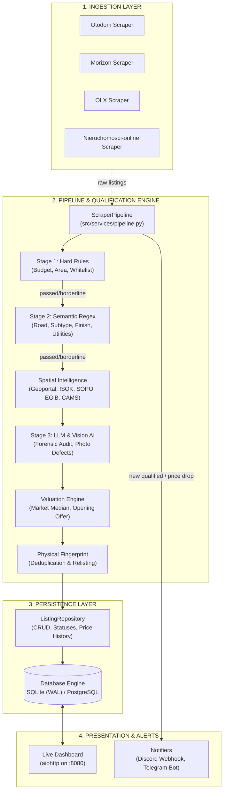

# Architecture & Data Flows — Universal Real Estate Hunter

System architecture, component boundaries, execution flows, and persistence model.

---

## 1. System Overview

Universal Real Estate Hunter consists of an automated ingestion and forensic qualification pipeline coupled with an asynchronous web dashboard and notification engine.

---

## 2. Representative Execution Flows

### Flow A: Ingestion & Forensic Qualification (`main.py once` / `main.py run`)

1. **Trigger**: Invoked via CLI `once`, scheduled daemon (`SchedulerRunner`), or Web UI (`/api/scrape/trigger`).
2. **Profile Configuration**: [`ConfigManager`](file:///C:/Users/User/WebstormProjects/apartments-scrapper/src/services/config_manager.py) resolves active search profiles (target city, radius, budget, whitelist areas).
3. **Scraping**: Selected scrapers fetch raw listings concurrently up to `CONCURRENT_REQUESTS` using `curl_cffi` Chrome TLS impersonation with rotating User-Agents.
4. **Pre-check (Stage 1)**: [`Stage1Filter`](file:///C:/Users/User/WebstormProjects/apartments-scrapper/src/filters/stage1_hard_rules.py) evaluates numeric criteria (price, house area, plot area) and location whitelists/blacklists. Failed listings that are not borderline are rejected immediately without network lookups.
5. **Spatial Intelligence**:
   - [`geocoder.py`](file:///C:/Users/User/WebstormProjects/apartments-scrapper/src/services/geocoder.py): Obtains GPS coordinates via Nominatim cache (`geocache` table).
   - [`geoportal.py`](file:///C:/Users/User/WebstormProjects/apartments-scrapper/src/services/geoportal.py): Queries GUGiK ULDK for parcel boundary, ISOK for flood zones, PIG-PIB SOPO for landslides, and EGiB for building registration.
   - [`air_quality.py`](file:///C:/Users/User/WebstormProjects/apartments-scrapper/src/services/air_quality.py): Evaluates winter PM2.5 heating averages and smog days.
   - [`commute.py`](file:///C:/Users/User/WebstormProjects/apartments-scrapper/src/services/commute.py): Queries OSRM for commute drive times and walkability to rail stations.
6. **Semantic Analysis (Stage 2)**: [`Stage2SemanticFilter`](file:///C:/Users/User/WebstormProjects/apartments-scrapper/src/filters/stage2_semantic.py) extracts road access, segment subtype, finish condition, 3D visualisations, and utilities.
7. **Stage 3 Enrichment (LLM & Vision AI)**:
   - [`LLMAnalyzer`](file:///C:/Users/User/WebstormProjects/apartments-scrapper/src/filters/llm_analyzer.py): Runs forensic audit prompt against description, resolving hidden costs, discrepancies with portal tags, and agent questions.
   - [`VisionAnalyzer`](file:///C:/Users/User/WebstormProjects/apartments-scrapper/src/filters/vision_analyzer.py): Audits photo gallery to confirm whether images are 3D renders or real photos, verifies finish condition, and flags defects.
8. **Scoring & Valuation**:
   - `apply_spatial_findings` applies penalty/bonus scores.
   - [`ValuationEngine`](file:///C:/Users/User/WebstormProjects/apartments-scrapper/src/services/market_analyzer.py) calculates market median per m², price deviation, days on market, and suggested opening offer.
9. **Deduplication & Persistence**:
   - [`generate_physical_fingerprint`](file:///C:/Users/User/WebstormProjects/apartments-scrapper/src/filters/fingerprint.py) correlates listings across different portals.
   - Saves record and price changes in [`ListingRepository`](file:///C:/Users/User/WebstormProjects/apartments-scrapper/src/storage/repository.py).
10. **Notifications**: [`DiscordNotifier`](file:///C:/Users/User/WebstormProjects/apartments-scrapper/src/services/discord_notifier.py) and [`TelegramNotifier`](file:///C:/Users/User/WebstormProjects/apartments-scrapper/src/services/telegram_notifier.py) broadcast new qualified offers or price drops if configured and outside quiet hours.

---

### Flow B: Web Dashboard & Due Diligence Drawer (`main.py dashboard`)

1. **Server Initialization**: [`LiveDashboardServer`](file:///C:/Users/User/WebstormProjects/apartments-scrapper/src/services/live_dashboard.py) initializes an `aiohttp.web` application on port 8080.
2. **Lean Card Endpoint (`/api/listings`)**: Emits listings stripped of heavy textual fields (`_LIST_OMIT_FIELDS`), enabling instant client-side rendering of hundreds of offers.
3. **Detail Drawer (`/api/listings/{id}`)**: Fetches full record including AI summary, stakeholder questions, documents to obtain, Vision AI defect breakdown, and spatial registry records.
4. **CRM Interactions**: Endpoints `/api/listings/{id}/status` and `/api/listings/{id}/notes` update user status (`FAVORITE`, `TO_VISIT`, `REJECTED`) and notes asynchronously.

---

## 3. Persistence & Concurrency Architecture

### Dual Database Backend
- **Primary / Default**: SQLite with WAL (`PRAGMA journal_mode=WAL`) and `PRAGMA busy_timeout=60000`, stored in `data/listings.db`.
- **Production / Scaled**: PostgreSQL + `asyncpg`. Auto-detected when port 5432 is listening locally, triggering automatic zero-loss data migration from SQLite.

### Write Locks & Retry Mechanism
- To prevent SQLite `database is locked` / `database is busy` errors under concurrent scraping passes and web requests:
  - All write operations must pass through [`safe_commit(session)`](file:///C:/Users/User/WebstormProjects/apartments-scrapper/src/storage/database.py).
  - An internal `asyncio.Lock()` serializes commits for SQLite.
  - Exponential backoff (up to 7 retries) automatically handles transient filesystem locks.

### Dynamic Column Migrations
- Schema additions are defined in [`LISTINGS_SCHEMA_MIGRATIONS`](file:///C:/Users/User/WebstormProjects/apartments-scrapper/src/storage/database.py).
- On application startup, `init_db()` inspects existing columns and executes idempotent `ALTER TABLE ... ADD COLUMN` statements for both SQLite and PostgreSQL.

---

## 4. External Integrations & Boundary Safeguards

| External Service | Protocol | Rate Limiting & Safeguards |
| :--- | :--- | :--- |
| **Portals (Otodom, Morizon, OLX, Nieruchomości-online)** | HTTPS (`curl_cffi` AsyncSession) | Rotating Chrome TLS fingerprints, exponential backoff, adaptive throttling multiplier (`self.delay`). |
| **GUGiK ULDK / KIEG** | REST / WMS | Cached responses in `spatial_cache` table; coordinate conversion fallback. |
| **Nominatim (OpenStreetMap)** | HTTP REST | Strict 1 req/sec rate limit; cached permanently in `geocache` table. |
| **CAMS & GIOŚ** | HTTP REST | Station coordinates cached in `spatial_cache`; stale distance threshold (>60 km invalidated). |
| **OSRM** | HTTP REST | Routing queries with fallback defaults if external routing fails. |
| **KRS / REGON (Rejestr.io / API)** | HTTP REST | Graceful degradation to empty findings if API is unreachable. |
| **Ollama / OpenAI / OpenRouter** | Async HTTP | Timeout safeguards (120s for vision, 30s for LLM); failure to parse LLM JSON falls back to Stage 2 regex. |
